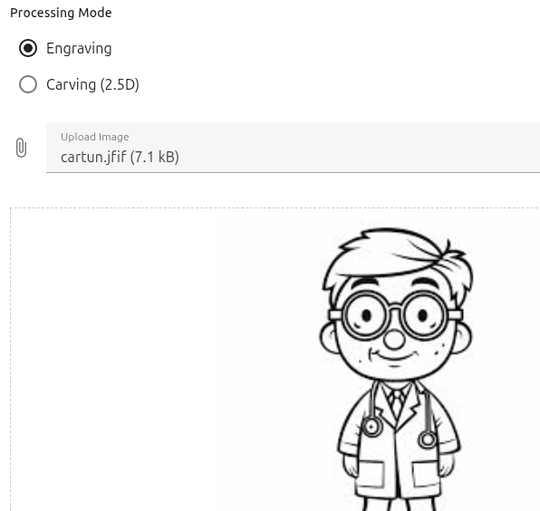
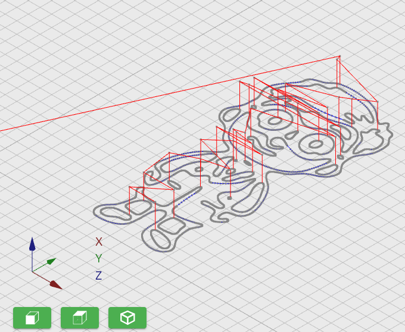

# Toolpath

**Generate, visualize, and analyze CNC G-code directly inside Visual Studio Code.**

Toolpath is a powerful extension that transforms images into precise machining instructions and lets you preview toolpaths without leaving your editor.

---

## 🚀 Key Features

### 🖼️ Image → G-code
Convert images into CNC toolpaths in seconds:
- 2D and 2.5D milling
- Laser engraving
- Fast and automated workflow

### 👁️ Toolpath Visualization
- Preview G-code before running it on your machine
- Inspect tool movements and detect issues early
- Reduce costly mistakes

### ⚡ All-in-One Workflow
- No need for external CAM software
- Everything happens inside VS Code
- Faster iteration and debugging

---

## 📸 Screenshots
### Original image

### Toolpath visualization

---

## ⚙️ How It Works

1. Open the Toolpath panel in VS Code
2. Load an image
3. Configure machining parameters
4. Generate G-code
5. Preview the toolpath
6. Export and run on your CNC machine

---

## 🧩 Use Cases

- PCB milling
- Laser engraving from images
- Rapid prototyping
- CNC hobby projects
- Toolpath debugging and analysis

---

## 💡 Why Toolpath?

Traditional CNC workflow is slow and fragmented:
- Multiple programs
- Complex setup
- Constant switching

**Toolpath simplifies everything:**

- ✔ Generate G-code instantly
- ✔ Visualize before cutting
- ✔ Stay inside your dev environment
- ✔ Iterate faster

---

## 🛠️ Features Inside VS Code

Toolpath adds a dedicated interface where you can:

- Generate G-code from images
- Preview toolpaths in real time
- Work with CNC files alongside your code

---

## 🔧 Requirements

- Visual Studio Code
- CNC machine (optional)
- Basic understanding of G-code (recommended)

---

## 🚧 Roadmap

We are actively developing Toolpath and plan to add:

- 🔥 CNC laser support
  Generate optimized G-code for laser engraving and cutting

- 🧠 Enhanced 2.5D machining
  More control, strategies, and precision

- 🧊 3D machining support
  Full 3D toolpath generation

- 🔌 CNC machine integration
  Connect to GRBLHal controllers via USB
  Control your CNC machine directly from VS Code

---

## 📄 License

MIT

---

## ⚠️ Disclaimer

Always verify generated G-code before running it on real hardware.
Improper toolpaths may damage your machine or material.
